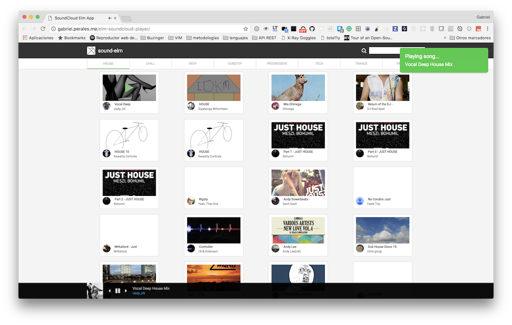

# Elm SoundCloud player

## What?

An example app done in Elm for learning Elm and Elm ports.
This project is based on https://soundredux.io from [@andrewngu](https://github.com/andrewngu).

## Why ?

There are not too many examples of how to use Elm ports. This is a fun
way to play sounds using them.

## Getting Started

This application needs an application client id for the soundcloud api. You can
put your client id in the file `config.env` and then you have to rename it to
just `.env`. Our code is going to load that file and set that variable as an
environment variable.

After that step, just install its dependencies with `npm install` and then
launch the `webpack dev server` with `npm start`.

## Build a bundle

You can compile the elm code to javascript just running `npm run build`.

## Contributing

Contributions are welcome!
